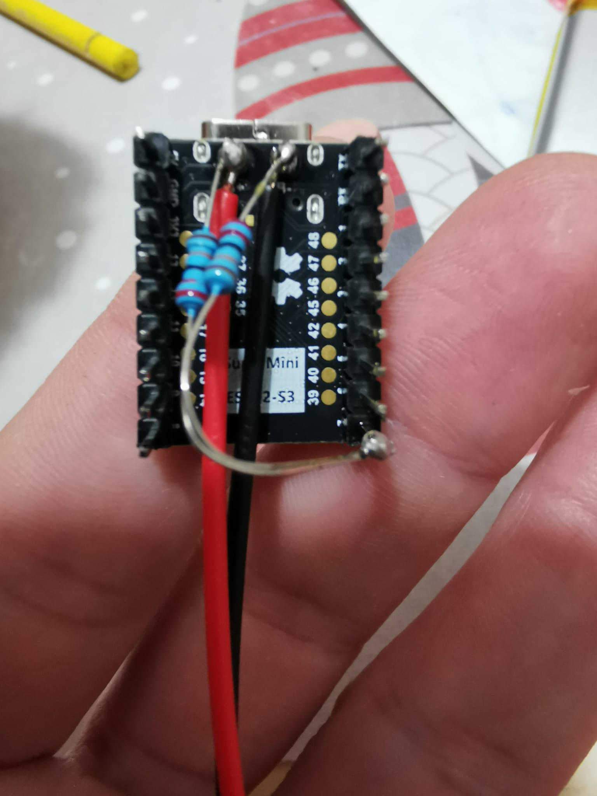
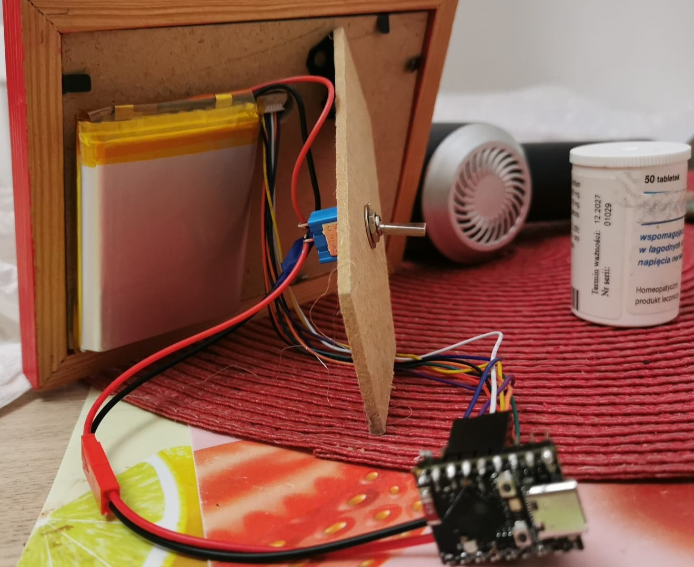

# Epaper Weather + Calendar + News Display

This project features an e-paper weather, calendar, and news display powered by an ESP32-S3 SuperMini board. The system updates every 10 minutes and goes into deep sleep between updates to save power. 

This project is a Work in Progress (WIP). Contributions and feedback are welcome!

## Features
Weather Display: Fetches temperature, humidity, and weather conditions using an online weather API.  
Calendar Events: Displays upcoming events from Google Calendar via a Google Apps Script.  
News Feed: Fetches and displays headlines from an RSS news feed.  
Power Efficiency: Uses the ESP32’s deep sleep mode to minimize power consumption.  
RTC Memory: Stores the array of headlines and calendar event in the RTC memory, ensuring it can display them seamlessly after waking up.  

## Power Management
The ESP32-S3 SuperMini is powered by a Li-Po battery. The dev board contains an integrated LTH7R charging IC to manage the battery.  
To monitor the battery level, a voltage divider circuit is used. The divider consists of 220k resistors and is connected to GPIO7. This setup ensures safe voltage measurements with the minimun battery drain. 
There is and on/off switch to disconnect the battery when required.

## RTC Memory and Deep Sleep Functionality
This project uses RTC (Real-Time Clock) memory to store critical data while the ESP32 is in deep sleep mode. Here's how it works:

The ESP32 updates weather, news, and calendar events every 10 minutes.
Before entering deep sleep, the current state (e.g., the last displayed news headline or calendar event) is saved to RTC memory.
Upon waking, the ESP32 retrieves this data from RTC memory to avoid redundant HTTP requests and ensure smooth cycling through news and events.
Deep sleep mode significantly reduces power consumption, making this project suitable for long-term battery-powered operation.

## Installation Prerequisites 
**Hardware:**

ESP32-S3 SuperMini board  
Compatible e-paper display (I am using WeAct 4.2 Inch Epaper Module)  
Battery (e.g., 5000mAh for extended operation)  
Voltage divider circuit with max 220k resistors (optional, for battery monitoring)  

**Software:**
Arduino IDE or PlatformIO for programming the ESP32

**Required libraries:**
Adafruit_GFX
GxEPD2
ArduinoJson
WiFi
HTTPClient

## Steps
**Set Up Weather API:**

Create an account on OpenWeatherMap (free).
Obtain an API key and configure the code to use it.

**Google Calendar Integration:**

Use Google Apps Script to create a web app that provides calendar events as JSON.
Follow Google’s Apps Script documentation to set up authentication and deployment.

**RSS News Feed:**

Add your preferred RSS feed URLs to the code, check that the objets have the same structure or name or modify the http request.

**ePaper display setup**  
To connect the e-paper display to the ESP32-S3, I use the following pin configuration:  
1 BUSY	GPIO4  
2 RES	GPIO2  
3 D/C	GPIO3  
4 CS	GPIO5  
5 SCL	GPIO12  
6 SDA	GPIO11  
7 GND	GND  
8 VCC	3V3  

Notes
This project is developed by someone without a formal programming background, bear in mind before attempting to use my code.
Lithium batteries are a fire hazard, make sure you understand their functioning before dealing with them.  
Contributions are welcome!
